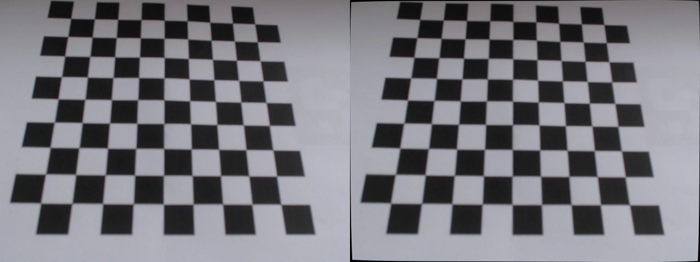

# Robot Perception - Medição de Objetos com Marcadores ArUco

## Introdução
Este trabalho foi feito como parte da disciplina de "Robot Perception" e tem como objetivo mostrar como usar visão computacional para medir objetos com marcadores ArUco. No projeto, foi criado um algoritmo com a biblioteca OpenCV para detectar os marcadores, corrigir distorções da câmera e calcular as dimensões reais dos objetos em um ambiente controlado. O sistema usa técnicas de calibração de câmera e processamento de imagens, destacando a importância da percepção robótica em tarefas que exigem medições precisas e confiáveis no mundo real.

## Requisitos do Sistema e Configuração do Ambiente
- Python 3.x
- OpenCV
- NumPy
- PyYAML

Para instalar as bibliotecas necessárias, execute:
```sh
pip install opencv-python numpy pyyaml
```

## Calibração
A calibração da câmera é um passo crucial para corrigir distorções e obter medições precisas. Utilizamos um padrão de tabuleiro de xadrez para realizar a calibração. As imagens capturadas são processadas para encontrar os cantos do tabuleiro e calcular a matriz de calibração da câmera.

### Resultados da Calibração
Aqui estão algumas imagens de resultado da calibração:




## Medição dos Objetos
Para medir os objetos, utilizamos marcadores ArUco que são detectados na imagem. A partir da detecção dos marcadores, calculamos a escala em pixels por milímetro e medimos as dimensões dos objetos presentes na imagem.

### Resultados da Medição
Aqui estão algumas imagens mostrando os resultados das medições:


## Conclusão
Este projeto demonstra a aplicação de técnicas de visão computacional para medir objetos com precisão usando marcadores ArUco e calibração de câmera. A percepção robótica desempenha um papel fundamental em tarefas que exigem medições precisas e confiáveis no mundo real.
